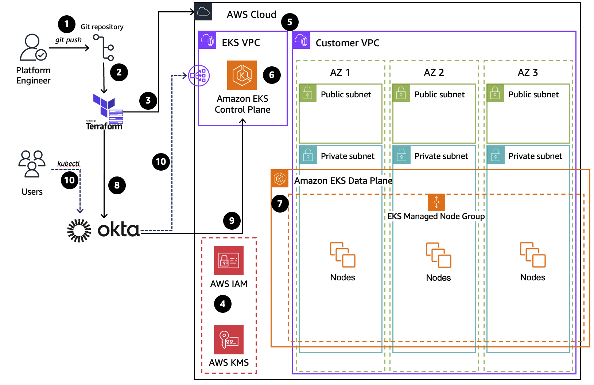

# Guidance for Amazon EKS Integrations with external SSO Providers

The Guidance title should be consistent with the title established first in Alchemy.

This title correlates exactly to the Guidance it’s linked to, including its corresponding sample code repository. 


## Table of Contents 


1. [Overview](#overview)
    - [Architecture and Message Flow](#architecture-and-workflow)
    - [AWS services in this Guidance](#aws-services-in-this-guidance)
    - [Cost](#cost)
3. [Prerequisites](#prerequisites-required)
    - [Operating System](#operating-system)
    - [Supported Regions](#supported-aws-regions)
4. [Deployment Steps](#deployment-steps)
5. [Deployment Validation](#deployment-validation)
6. [Running the Guidance](#running-the-guidance)
7. [Next Steps](#next-steps)
8. [Cleanup](#cleanup)

***Optional***

8. [FAQ, known issues, additional considerations, and limitations](#faq-known-issues-additional-considerations-and-limitations-optional)
9. [Revisions](#revisions-optional)
10. [Notices](#notices)
11. [Authors](#authors)

## Overview

<!--
1. Provide a brief overview explaining the what, why, or how of your Guidance. You can answer any one of the following to help you write this:

    - **Why did you build this Guidance?**
    - **What problem does this Guidance solve?**
-->
- Many enterprise AWS customers using 3rd party Single Sign-On (SSO) authentication providers need to integrate their EKS cluster authentication with those providers for consistent application security posture
- This guidance demonstrates how to automate deployment an Amazon EKS cluster into the AWS Cloud, to be integrated with various Identity Providers (IdP) for Single Sign-On (SSO) authentication using Terraform based blueprints. The configuration for authorization is done using Kubernetes Role-based access control (RBAC).

<!--
2. Include the architecture diagram image, as well as the steps explaining the high-level overview and flow of the architecture. 
    - To add a screenshot, create an ‘assets/images’ folder in your repository and upload your screenshot to it. Then, using the relative file path, add it to your README. 
-->

### Architecture and Workflow


    
Figure 1. Reference Architecture of Guidance for Amazon EKS Integrations with external SSO Providers   
</div>

1. User (Platform Engineer) commits and pushes [Terraform](https://www.hashicorp.com/products/terraform) Infrastructure as Code (IaC) changes to EKS Blueprints Git repository.
2. Terraform Infrastructure provisioning workflow gets triggered upon code push to Git repo or initiated manually by Platform Engineer.
3. Terraform starts resource deployment/reconciliation processes to the target AWS Cloud and [Okta](https://www.okta.com/) environments.
4. Required [Amazon Identity and Access Management (IAM)](https://aws.amazon.com/iam/) Roles, Polices and [Key Management Service (KMS)](https://aws.amazon.com/kms/) keys are created.
5. [Amazon Virtual Private Cloud (VPCs)](https://aws.amazon.com/vpc/), related Subnets, Endpoints and NET Gateways are deployed.
6. [Amazon Elastic Kubernetes Service (EKS)](https://aws.amazon.com/eks/) Cluster Control plane is deployed into EKS managed VPC. 
7. Amazon EKS Data Plane, [EKS Add-ons]](https://docs.aws.amazon.com/eks/latest/userguide/eks-add-ons.html) and [Managed Node Groups](https://docs.aws.amazon.com/eks/latest/userguide/managed-node-groups.html) are deployed into Customer VPC.
8. Okta resources, Oauth server, users, groups, and role assignments are created in the designated [Okta organization](https://developer.okta.com/docs/concepts/okta-organizations/).
9. Integration between EKS and Okta SSO Provider is established together with [Kubernetes Roles and RoleBidindings](https://kubernetes.io/docs/reference/access-authn-authz/rbac/).
10. Amazon EKS Cluster is available for applications and end users, Kubernetes API is accessible to CLI clients via [Elastic Load Balancer (ELB)](https://aws.amazon.com/elasticloadbalancing/) with Okta SSO authentication


### AWS services in this Guidance
| **AWS service**  | Role | Description |
|-----------|------------|-------------|
| [Amazon Elastic Kubernetes Service (EKS)](https://aws.amazon.com/eks/)| Core service |  EKS service is used to host the Karmada solution that uses containers. In essence it is an extension of the Kubernetes API.|
| [Amazon Elastic Compute Cloud (EC2)](https://aws.amazon.com/ec2/)| Core service | EC2 service is used as the host of the containers needed for this solution.|
[Amazon Virtual Private Cloud - VPC](https://aws.amazon.com/vpc/)| Core Service | Network security layer |
| [Amazon Elastic Conatiner Registry - ECR](http://aws.amazon.com/ecr/) | Supporting service | Used for storing container images required by the runtimes. |
| [Amazon Network Load Balancer (NLB)](https://aws.amazon.com/elasticloadbalancing/network-load-balancer/)|Supporting service | The NLB  is the entry point to interact with the K8s API server|
| [Amazon Elastic Block Store (EBS)](https://aws.amazon.com/ebs)|Supporting service | Encrypted EBS volumes are used by the Karmada etcd database attached to compute nodes/EC2 instances to keep its state and consistency. All state changes and updates get persisted in EBS volumes across all EC2 compute nodes that host etcd pods.|
| [AWS Identity and Access Management (IAM)](https://aws.amazon.com/iam/)|Supporting service |  AWS IAM service is used for the creation of an IAM user with adequate permissions to create and delete Amazon EKS clusters access.|


### Cost

This section is for a high-level cost estimate. Think of a likely straightforward scenario with reasonable assumptions based on the problem the Guidance is trying to solve. Provide an in-depth cost breakdown table in this section below ( you should use AWS Pricing Calculator to generate cost breakdown ).

Start this section with the following boilerplate text:

_You are responsible for the cost of the AWS services used while running this Guidance. As of <month> <year>, the cost for running this Guidance with the default settings in the <Default AWS Region (Most likely will be US East (N. Virginia)) > is approximately $<n.nn> per month for processing ( <nnnnn> records )._

Replace this amount with the approximate cost for running your Guidance in the default Region. This estimate should be per month and for processing/serving resonable number of requests/entities.

Suggest you keep this boilerplate text:
_We recommend creating a [Budget](https://docs.aws.amazon.com/cost-management/latest/userguide/budgets-managing-costs.html) through [AWS Cost Explorer](https://aws.amazon.com/aws-cost-management/aws-cost-explorer/) to help manage costs. Prices are subject to change. For full details, refer to the pricing webpage for each AWS service used in this Guidance._

### Sample Cost Table

**Note : Once you have created a sample cost table using AWS Pricing Calculator, copy the cost breakdown to below table and upload a PDF of the cost estimation on BuilderSpace. Do not add the link to the pricing calculator in the ReadMe.**

The following table provides a sample cost breakdown for deploying this Guidance with the default parameters in the US East (N. Virginia) Region for one month.

The following sample table provides a sample cost breakdown for deploying this guidance with 3 Amazon EKS clusters (one Karmada control plane and 2 managed clusters) in the US-East-1 `us-east-1` region for one month. The AWS cost calculator is available [here](https://calculator.aws/#/estimate?id=03fdada5a7299a7b70c51a6c9b0037cd0117cbfc). Please that cost calculations are based on the default configuration options of the [End-to-end, fully automated](#end-to-end-fully-automated) guidance deployment method described below.

| **AWS service**  | Dimensions | Cost, month \[USD\] |
|-----------|------------|------------|
| Amazon EKS  | 1 Cluster | \$ 73 |
| Amazon EC2  | 2-5 Nodes on the Managed Node Group | \$ 125.56-$ 350.45 |
| VPC | 1 VPC, 1 NAT Gateway, 1 Public IPv4 | \$ 36.50 | 
| **TOTAL estimate** |  | **\$ 235.06-$ 459.95** |

Detailed cost breakdown is available via this [Cost calculator](https://calculator.aws/#/estimate?id=c95b08fa878bb02e81b2704ca7df3754f75d13c8)

## Security

When you build systems on AWS infrastructure, security responsibilities are shared between you and AWS. This [shared responsibility model](https://aws.amazon.com/compliance/shared-responsibility-model/) reduces your operational burden because AWS operates, manages, and controls the components including the host operating system, the virtualization layer, and the physical security of the facilities in which the services operate. For more information about AWS security visit [AWS Cloud Security](http://aws.amazon.com/security/).

This guidance relies on a lot of reasonable default options and "principle of least privilege" access for all resources. Users that deploy it in production should go through all the deployed resources and ensure those defaults comply with their security requirements and policies, have adequate logging levels and alarms enabled and protect access to publicly exposed APIs

## Prerequisites

### Operating System

- Talk about the base Operating System (OS) and environment that can be used to run or deploy this Guidance, such as *Mac, Linux, or Windows*. Include all installable packages or modules required for the deployment. 
- By default, assume Amazon Linux 2/Amazon Linux 2023 AMI as the base environment. All packages that are not available by default in AMI must be listed out.  Include the specific version number of the package or module.

**Example:**
“These deployment instructions are optimized to best work on **<Amazon Linux 2 AMI>**.  Deployment in another OS may require additional steps.”

- Include install commands for packages, if applicable.


### Third-party tools (If applicable)

*List any installable third-party tools required for deployment.*


### AWS account requirements (If applicable)

*List out pre-requisites required on the AWS account if applicable, this includes enabling AWS regions, requiring ACM certificate.*

**Example:** “This deployment requires you have public ACM certificate available in your AWS account”

**Example resources:**
- ACM certificate 
- DNS record
- S3 bucket
- VPC
- IAM role with specific permissions
- Enabling a Region or service etc.


### aws cdk bootstrap (if sample code has aws-cdk)

<If using aws-cdk, include steps for account bootstrap for new cdk users.>

**Example blurb:** “This Guidance uses aws-cdk. If you are using aws-cdk for first time, please perform the below bootstrapping....”

### Service limits  (if applicable)

<Talk about any critical service limits that affect the regular functioning of the Guidance. If the Guidance requires service limit increase, include the service name, limit name and link to the service quotas page.>

### Supported AWS Regions

The AWS services used for this guidance are supported in *all available AWS regions*: 

## Deployment Steps

Deployment steps must be numbered, comprehensive, and usable to customers at any level of AWS expertise. The steps must include the precise commands to run, and describe the action it performs.

* All steps must be numbered.
* If the step requires manual actions from the AWS console, include a screenshot if possible.
* The steps must start with the following command to clone the repo. ```git clone xxxxxxx```
* If applicable, provide instructions to create the Python virtual environment, and installing the packages using ```requirement.txt```.
* If applicable, provide instructions to capture the deployed resource ARN or ID using the CLI command (recommended), or console action.

 
**Example:**

1. Clone the repo using command ```git clone xxxxxxxxxx```
2. cd to the repo folder ```cd <repo-name>```
3. Install packages in requirements using command ```pip install requirement.txt```
4. Edit content of **file-name** and replace **s3-bucket** with the bucket name in your account.
5. Run this command to deploy the stack ```cdk deploy``` 
6. Capture the domain name created by running this CLI command ```aws apigateway ............```


## Deployment Validation

<Provide steps to validate a successful deployment, such as terminal output, verifying that the resource is created, status of the CloudFormation template, etc.>


**Examples:**

* Open CloudFormation console and verify the status of the template with the name starting with xxxxxx.
* If deployment is successful, you should see an active database instance with the name starting with <xxxxx> in        the RDS console.
*  Run the following CLI command to validate the deployment: ```aws cloudformation describe xxxxxxxxxxxxx```


## Running the Guidance

<Provide instructions to run the Guidance with the sample data or input provided, and interpret the output received.> 

This section should include:

* Guidance inputs
* Commands to run
* Expected output (provide screenshot if possible)
* Output description


## Next Steps

Provide suggestions and recommendations about how customers can modify the parameters and the components of the Guidance to further enhance it according to their requirements.


## Cleanup

- Include detailed instructions, commands, and console actions to delete the deployed Guidance.
- If the Guidance requires manual deletion of resources, such as the content of an S3 bucket, please specify.


## FAQ, known issues, additional considerations, and limitations (optional)


**Known issues (optional)**

<If there are common known issues, or errors that can occur during the Guidance deployment, describe the issue and resolution steps here>


**Additional considerations (if applicable)**

<Include considerations the customer must know while using the Guidance, such as anti-patterns, or billing considerations.>

**Examples:**

- “This Guidance creates a public AWS bucket required for the use-case.”
- “This Guidance created an Amazon SageMaker notebook that is billed per hour irrespective of usage.”
- “This Guidance creates unauthenticated public API endpoints.”


Provide a link to the *GitHub issues page* for users to provide feedback.


**Example:** *“For any feedback, questions, or suggestions, please use the issues tab under this repo.”*

## Revisions (optional)

Document all notable changes to this project.

Consider formatting this section based on Keep a Changelog, and adhering to Semantic Versioning.

## Notices

Include a legal disclaimer

**Example:**
*Customers are responsible for making their own independent assessment of the information in this Guidance. This Guidance: (a) is for informational purposes only, (b) represents AWS current product offerings and practices, which are subject to change without notice, and (c) does not create any commitments or assurances from AWS and its affiliates, suppliers or licensors. AWS products or services are provided “as is” without warranties, representations, or conditions of any kind, whether express or implied. AWS responsibilities and liabilities to its customers are controlled by AWS agreements, and this Guidance is not part of, nor does it modify, any agreement between AWS and its customers.*


## Authors 

- Rodrigo Bersa, Sr.Specialist SA, Containers
- Daniel Zilberman, Sr.Specialist SA, Technical Solutions
