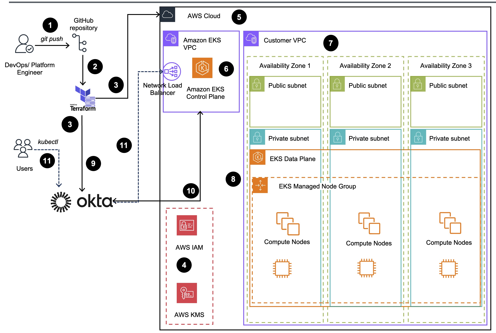

# Guidance for Amazon EKS Integrations with external SSO Providers

The Guidance title should be consistent with the title established first in Alchemy.

This title correlates exactly to the Guidance it’s linked to, including its corresponding sample code repository. 


## Table of Contents 


1. [Overview](#overview)
    - [Architecture and Message Flow](#architecture-and-workflow)
    - [AWS services in this Guidance](#aws-services-in-this-guidance)
    - [Cost](#cost)
3. [Prerequisites](#prerequisites-required)
    - [Operating System](#operating-system)
    - [Supported Regions](#supported-aws-regions)
4. [Deployment Steps](#deployment-steps)
5. [Deployment Validation](#deployment-validation)
6. [Running the Guidance](#running-the-guidance)
7. [Next Steps](#next-steps)
8. [Cleanup](#cleanup)

***Optional***

8. [FAQ, known issues, additional considerations, and limitations](#faq-known-issues-additional-considerations-and-limitations-optional)
9. [Revisions](#revisions-optional)
10. [Notices](#notices)
11. [Authors](#authors)

## Overview

<!--
1. Provide a brief overview explaining the what, why, or how of your Guidance. You can answer any one of the following to help you write this:

    - **Why did you build this Guidance?**
    - **What problem does this Guidance solve?**
-->
- Many enterprise AWS customers using 3rd party Single Sign-On (SSO) authentication providers need to integrate their EKS cluster authentication with those providers for consistent application security posture
- This guidance demonstrates how to automate deployment an Amazon EKS cluster into the AWS Cloud, to be integrated with various Identity Providers (IdP) for Single Sign-On (SSO) authentication using Terraform based blueprints. The configuration for authorization is done using Kubernetes Role-based access control (RBAC).

<!--
2. Include the architecture diagram image, as well as the steps explaining the high-level overview and flow of the architecture. 
    - To add a screenshot, create an ‘assets/images’ folder in your repository and upload your screenshot to it. Then, using the relative file path, add it to your README. 
-->

### Architecture and Workflow


    
Figure 1. Amazon EKS Integrations with external SSO Providers - Reference Architecture
</div>

1. User (Platform Engineer) commits and pushes [Terraform](https://www.hashicorp.com/products/terraform) Infrastructure as Code (IaC) changes to EKS Blueprints GitHub repository.
2. Terraform Infrastructure provisioning workflow gets triggered upon code push to GitHub repo or initiated manually by Platform Engineer.
3. Terraform starts resource deployment/reconciliation processes to the target AWS Cloud and [Okta](https://www.okta.com/) environments.
4. Required [Amazon Identity and Access Management (IAM)](https://aws.amazon.com/iam/) Roles, Polices and [Key Management Service (KMS)](https://aws.amazon.com/kms/) keys are created.
5. [Amazon Virtual Private Cloud (VPCs)](https://aws.amazon.com/vpc/), related Subnets, Endpoints and NET Gateways are deployed.
6. [Amazon Elastic Kubernetes Service (EKS)](https://aws.amazon.com/eks/) Cluster Control plane is deployed into EKS VPC.The cluster control plane is provisioned across multiple Availability Zones and fronted by [Network Load Balancing (NLB)](https://aws.amazon.com/elasticloadbalancing/network-load-balancer/)
7. Customer VPC for Amazon EKS Compute Plane with Public and Private subnets and other networking components is deployed
8. Amazon EKS Compute Plane with Managed Node Groups containing Amazon Elastic Compute Cloud (Amazon EC2) compute nodes running [AWS Bottlerocket](https://aws.amazon.com/bottlerocket/?amazon-bottlerocket-whats-new&amazon-bottlerocket-whats-new.sort-by=item.additionalFields.postDateTime&amazon-bottlerocket-whats-new.sort-order=desc) OS 
are deployed into Customer VPC along with  [EKS Add-ons](https://docs.aws.amazon.com/eks/latest/userguide/eks-add-ons.html)
9. Okta resources, Oauth server, users, groups, and role assignments are created in the designated [Okta organization](https://developer.okta.com/docs/concepts/okta-organizations/).
11. Integration between EKS and Okta SSO Provider is established together with required [Kubernetes Roles and RoleBidindings](https://kubernetes.io/docs/reference/access-authn-authz/rbac/).
12. Amazon EKS Cluster is available for applications and end users, Kubernetes API is accessible via  [Network Load Balancer (NLB)](https://docs.aws.amazon.com/elasticloadbalancing/latest/network/introduction.html) with Okta SSO user authentication


### AWS Services in this guidance
| **AWS service**  | Role | Description |
|-----------|------------|-------------|
| [Amazon Elastic Kubernetes Service (EKS)](https://aws.amazon.com/eks/)| Core service |  EKS service is used to host the Karmada solution that uses containers. In essence it is an extension of the Kubernetes API.|
| [Amazon Elastic Compute Cloud (EC2)](https://aws.amazon.com/ec2/)| Core service | EC2 service is used as the host of the containers needed for this solution.|
| [Amazon Virtual Private Cloud - VPC](https://aws.amazon.com/vpc/)| Core Service | Network security layer |
| [Amazon Elastic Conatiner Registry - ECR](http://aws.amazon.com/ecr/) | Supporting service | Used for storing container images required by the runtimes. |
| [Amazon Network Load Balancer (NLB)](https://aws.amazon.com/elasticloadbalancing/network-load-balancer/)|Supporting service | The NLB  is the entry point to interact with the K8s API server|
| [Amazon Elastic Block Store (EBS)](https://aws.amazon.com/ebs)|Supporting service | Encrypted EBS volumes are used by the Karmada etcd database attached to compute nodes/EC2 instances to keep its state and consistency. All state changes and updates get persisted in EBS volumes across all EC2 compute nodes that host etcd pods.|
| [AWS Identity and Access Management (IAM)](https://aws.amazon.com/iam/)|Supporting service |  AWS IAM service is used for the creation of an IAM user with adequate permissions to create and delete Amazon EKS clusters access.|
| [AWS Key Management Service (KMS)](https://aws.amazon.com/kms/)|Supporting service |  AWS KMS is responsible for managing encryption keys that can be applied to several resouces, making sure to protect data at rest. Some examples of encrypted resources on this solution are Amazon EBS volumes, and Amazon EKS Clusters.|

### Cost

You are responsible for the cost of the AWS services used while running this Guidance. As of October, 2024 , the cost for running this Guidance with the default settings in the `us-east-1` Region (US East (N. Virginia))  is approximately $235.06-$459.95 per month.

We recommend creating a [Budget](https://docs.aws.amazon.com/cost-management/latest/userguide/budgets-managing-costs.html) through [AWS Cost Explorer](https://aws.amazon.com/aws-cost-management/aws-cost-explorer/) to help manage costs. Prices are subject to change. For full details, refer to the pricing webpage for each AWS service used in this Guidance.

### Sample Cost Table

**Note : Once you have created a sample cost table using AWS Pricing Calculator, copy the cost breakdown to below table and upload a PDF of the cost estimation on BuilderSpace. Do not add the link to the pricing calculator in the ReadMe.**

The following table provides a sample cost breakdown for deploying this Guidance with the default parameters in the US East (N. Virginia) Region for one month.

The following sample table provides a sample cost breakdown for deploying this guidance with 3 Amazon EKS clusters (one Karmada control plane and 2 managed clusters)
in the US-East-1 `us-east-1` region for one month. The AWS cost calculator is available [here](https://calculator.aws/#/estimate?id=03fdada5a7299a7b70c51a6c9b0037cd0117cbfc). 
Please that cost calculations are based on the default configuration options of the [End-to-end, fully automated](#end-to-end-fully-automated) guidance deployment method described below.

| **AWS service**  | Dimensions | Cost, month \[USD\] |
|-----------|------------|------------|
| Amazon EKS  | 1 Cluster | \$ 73 |
| Amazon EC2  | 2-5 Nodes on the Managed Node Group | \$ 125.56-$ 350.45 |
| VPC | 1 VPC, 1 NAT Gateway, 1 Public IPv4 | \$ 36.50 | 
| **TOTAL estimate** |  | **\$ 235.06-$ 459.95** |


## Security

When you build systems on AWS infrastructure, security responsibilities are shared between you and AWS. This [shared responsibility model](https://aws.amazon.com/compliance/shared-responsibility-model/) reduces your operational burden because AWS operates, manages, and controls the components including the host operating system, the virtualization layer, and the physical security of the facilities in which the services operate. For more information about AWS security visit [AWS Cloud Security](http://aws.amazon.com/security/).

This guidance relies on a several reasonable default options and "principle of least privilege" access for all resources, being it's main goal to control an manage users and groups access to Amazon EKS clusters. Relying on [Okta](https://www.okta.com/) as the Single Sign-On (SSO) option for the authentication side and Kubernetes Native [Role-based Access Control (RBAC)](https://kubernetes.io/docs/reference/access-authn-authz/rbac/) for the authotization side, only authenticated users be able to login into to the cluster, and the level of access within it can be very granular to specific actions on specific resources.

On the infrastructure protection, Bottlerocket, a minimal operational system specifically designed to work with container orchestrators is the option for host operational system, reducing the surface area of attacks by disabling SSH access, and enforcicing [SELinux](https://selinuxproject.org/page/Main_Page) by default.

The guidance also ensure data protection with encryption enabled on Amazon EKS at the cluster level, together with all EC2 instances volumes encrypted during the node creation time using Amazon KMS, making sure that all data is encrypted by default. The Amazon EKS encryption configuration enables envelope encryption of Kubernetes secrets using KMS as well. 

## Prerequisites

### Operating System

This solution relies on [AWS Bottlerocket](https://aws.amazon.com/bottlerocket/?amazon-bottlerocket-whats-new&amazon-bottlerocket-whats-new.sort-by=item.additionalFields.postDateTime&amazon-bottlerocket-whats-new.sort-order=desc) as the Operational System on the Amazon EKS worker nodes. It keeps three primary goals: **Minimal** - **Safe Updates** - **Security Focused**.

Bottlerocket is a Linux-based operating system optimized for hosting containers. It’s free and open-source software, developed in the open on GitHub. Bottlerocket is installed as the base operating system on the data plane side of the Amazon EKS clusters, where your containers are running. It is specifically designed to work with container orchestrator, suchas Kubernetes, to automate the lifecycle of the containers running in your cluster. 

Because it's API driven, Bottlerocket comes ready to run on Amazon EKS without any additional packages or requirements, being an out-of-the-box solution, already compliant with **CIS Benchmark Level 1**.

### Third-party tools (If applicable)

[Okta Single Sign-On](https://www.okta.com/products/single-sign-on-customer-identity/) is the only third-party software deployed as part of this solution. Okta SSO management platform provides control, security, and easiness where users can simply log in once and use all accessible resources.

### AWS account requirements

This guidance requires you to have an active AWS account. The required resources will be deployed via Terraform.

### Supported AWS Regions

The AWS services used for this guidance are supported in all AWS regions at this moment.

## Deployment Steps

1. Clone the repo using command.
   ```sh
   git clone https://github.com/aws-solutions-library-samples/guidance-for-amazon-eks-integrations-with-external-sso-providers-on-aws/
   ```
2. Go to the Terraform code folder.
   ```sh
   cd guidance-for-amazon-eks-integrations-with-external-sso-providers-on-aws/source
   ```
3. Adjust any required variables on the `variables.tf` file or creating a `.tfvars` file.
4. Edit the `okta.tf` file to insert values for your Okta organization and token.
5. Initialize Terraform providers.
   ```sh
   terraform init
   ```
6. Plan your Terraform deployment.
   ```sh
   terraform plan
   ```
8. Apply the Terraform code, using a targeted approach
   ```
   terraform apply -target module.vpc -auto-approve
   terraform apply -target module.eks -auto-approve
   terraform apply -auto-approve
   ```

## Deployment Validation

After the `terraform` commands are executed successfully, check if the newly created users are active.

To do that use the link provided in the email invite if you added a valid email address for your users, or go to the [Okta Admin Dashboard](https://dev-ORGID-admin.okta.com/admin/users/), select the user, and click on *Set Password and Activate* button.

1. With the active users, use the `terraform output` example to setup your `kubeconfig` profile to authenticate through Okta.

    ```
    configure_kubeconfig = <<EOT
    kubectl config set-credentials oidc \
      --exec-api-version=client.authentication.k8s.io/v1beta1 \
      --exec-command=kubectl \
      --exec-arg=oidc-login \
      --exec-arg=get-token \
      --exec-arg=--oidc-issuer-url=https://dev-ORGID.okta.com/oauth2/1234567890abcdefghij \
      --exec-arg=--oidc-client-id=1234567890abcdefghij
      --exec-arg=--oidc-extra-scope="email offline_access profile openid"
    ```

2. With the `kubeconfig` configured, you'll be able to run `kubectl` commands in your Amazon EKS Cluster using the `--user` cli option to impersonate the Okta authenticated user. When `kubectl` command is issued with the `--user` option for the first time, your browser window will open and require you to authenticate.

    The read-only user has a `cluster-viewer` Kubernetes role bound to it's group, whereas the admin user, has the `admin` Kubernetes role bound to it's group.

    ```
    kubectl get pods -A
    NAMESPACE          NAME                        READY   STATUS    RESTARTS   AGE
    amazon-guardduty   aws-guardduty-agent-bl2v2   1/1     Running   0          3h54m
    amazon-guardduty   aws-guardduty-agent-s1vcx   1/1     Running   0          3h54m
    amazon-guardduty   aws-guardduty-agent-w8gfc   1/1     Running   0          3h54m
    kube-system        aws-node-m9hmd              1/1     Running   0          3h53m
    kube-system        aws-node-w42b8              1/1     Running   0          3h53m
    kube-system        aws-node-wm6rm              1/1     Running   0          3h53m
    kube-system        coredns-6ff9c46cd8-94jlr    1/1     Running   0          3h59m
    kube-system        coredns-6ff9c46cd8-nw2rb    1/1     Running   0          3h59m
    kube-system        kube-proxy-7fb86            1/1     Running   0          3h54m
    kube-system        kube-proxy-p4f5g            1/1     Running   0          3h54m
    kube-system        kube-proxy-qk2mc            1/1     Running   0          3h54m
    ```

3. You can also use the `configure_kubectl` output to assume the *Cluster creator* role with `cluster-admin` access.

    ```
    configure_kubectl = "aws eks --region us-west-2 update-kubeconfig --name okta"
    ```

4. It's also possible to pre-configure your `kubeconfig` using the `okta_login` output. This will also require you to authenticate in a browser window.

    ```
    okta_login = "kubectl oidc-login setup --oidc-issuer-url=https://dev-ORGID.okta.com/oauth2/1234567890abcdefghij--oidc-client-id=1234567890abcdefghij"
    ```

## Cleanup

1. To tear down all the provisioned resources, run the Terraform destroy command from the same directory it was applied.

    ```
    cd guidance-for-amazon-eks-integrations-with-external-sso-providers-on-aws/source
    terraform destroy -auto-approve
    ```

## Next Steps

Provide suggestions and recommendations about how customers can modify the parameters and the components of the Guidance to further enhance it according to their requirements.

## Notices

Include a legal disclaimer

*Customers are responsible for making their own independent assessment of the information in this Guidance. This Guidance: (a) is for informational purposes only, (b) represents AWS current product offerings and practices, which are subject to change without notice, and (c) does not create any commitments or assurances from AWS and its affiliates, suppliers or licensors. AWS products or services are provided “as is” without warranties, representations, or conditions of any kind, whether express or implied. AWS responsibilities and liabilities to its customers are controlled by AWS agreements, and this Guidance is not part of, nor does it modify, any agreement between AWS and its customers.*


## Authors 

- Rodrigo Bersa, Sr.Specialist SA, Containers
- Daniel Zilberman, Sr.Specialist SA, Technical Solutions
